# End to End Learning for Self-Driving Car
  
  
<p align="center">
    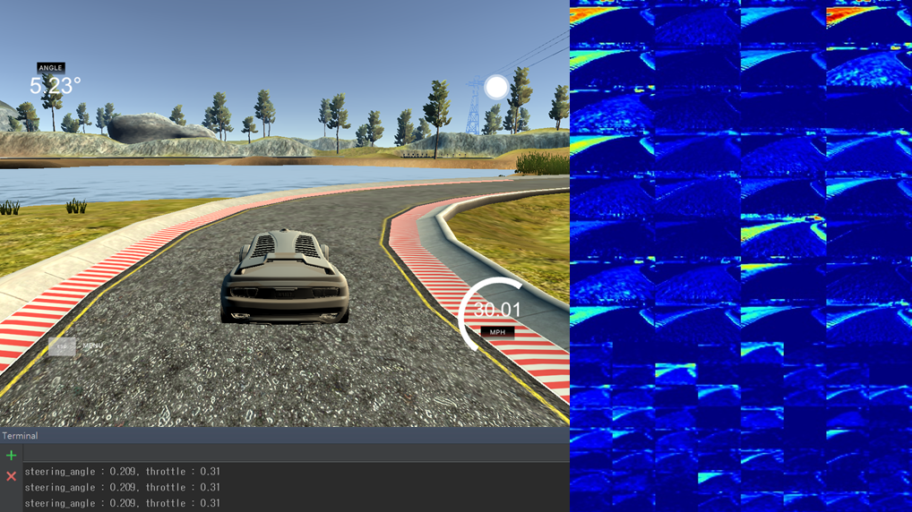<br>
    <b>result image(watch the full video below)</b><br>
</p>
  
 
## Introduction  
  
>This is Udacity's Self-Driving Car Nanodegree Project.
Our goal is a **self-driving** by using behavior cloning. It means that the point is **mimicing driver's behavior** without any detection such as lane marking detection, path planning. In this project, we train our car by using recorded driving images in a simulator provided by Udacity. In the simulator, we record images, steering angle, throttle, speed, etc. The main data is image and steering angle. Design our CNN model and after training, the network model predict a steering angle in every frames. So our trained car can drive autonomously. Also, we evaluate the model with untrained track.  
  
  
Before start this project,  
 
* NVIDIA 2016 Paper [End to End Learning for Self-Driving Cars](http://images.nvidia.com/content/tegra/automotive/images/2016/solutions/pdf/end-to-end-dl-using-px.pdf)
would be good guide to understand the exact concept.  
* In a MIT winter 2017 course [Deep Learning for Self-Driving Cars](http://selfdrivingcars.mit.edu/deeptesla/), they are working on a **deeptesla** project and similar with this project.  
* [comma.ai](https://github.com/commaai/research) shared their dataset & codes. 
 
 
 
## Installation & Environment  
 
### Installation
 
* __Simulator__  
 
    [Windows 64 bit](https://d17h27t6h515a5.cloudfront.net/topher/2016/November/5831f3a4_simulator-windows-64/simulator-windows-64.zip)  
    [macOS](https://d17h27t6h515a5.cloudfront.net/topher/2016/November/5831f290_simulator-macos/simulator-macos.zip)  
    [Linux](https://d17h27t6h515a5.cloudfront.net/topher/2016/November/5831f0f7_simulator-linux/simulator-linux.zip)  
 
 
* __Dataset__  
 
    [data](https://d17h27t6h515a5.cloudfront.net/topher/2016/December/584f6edd_data/data.zip) (Track1 data provided by Udacity)
 
 
### Environment  
  
#### software  
  
>Windows 10(x64), tensorflow 0.12.1, keras, Python 3.5, OpenCV 3.1.0, pycharm  
 
#### hardware  
  
>CPU : i7-4720HQ 2.60GHz, GPU : GTX 970M, Memory : 16GB  
    
## Files
  
[`model.py`](model.py) : training model  
[`drive.py`](drive.py) : drive a car in a simulator  
[`model.json`](model.json) : saved training model  
[`model.h5`](model.h5) : saved training weight  
[`model.ipynb`](model.ipynb) : code for readme images  
  
To test self-driving(autonomous mode), type `python drive.py model.json` on terminal.  
 
 
## Data Collection  
  
<p align="center">
    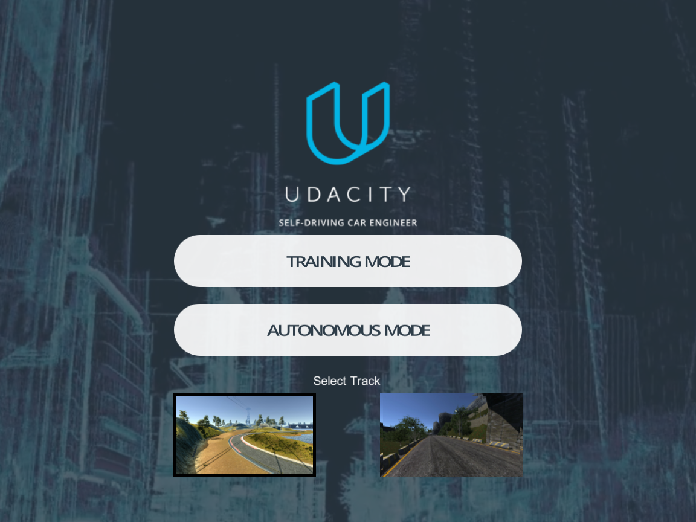
</p>
 
In the simulator, we have two modes and two racing tracks.  
 
**`TRAINING MODE`** : Coltrol a car with keyboard or joystick. Collect image datas by clicking a record button.  
 
**`AUTONOMOUS MODE`** : Test my trained car.  
 
 
**Data collection should only be performed in Track1.**  
We'll evaluate our network model operates well in an untrained track.(Track2)  
 
In an autonomous mode, The trained car will drive by mimicing our control. That means that if we want high-quality results, we need a cautious vehicle-control. So we could use joystick instead of keyboard to get soft angle change. (but if you don't have joystick, don't worry. I didn't use it too.)  
In udacity course, they said **"garbage in, garbage out."**  
 
 
Also when we record driving, we need data about `steer back to the middle from the side of the road`. If all of our data is collected with driving in the middle of the road, our car couldn't recover to the middle from the side. But it's really hard to collect many recovery data because our dataset __must not have 'weaving out to the side' data__. It seems like teaching a way out of a road. That will deteriorate your performance.
  
And we have 3 cameras in a simulator. We could map recovery paths from each camera. If middle camera image is pointing 'left turn', we could get 'soft left turn' with left camera and 'sharp left turn' with right camera. So we could collect much more diverse datas.  
  
  
I used [udacity dataset](https://d17h27t6h515a5.cloudfront.net/topher/2016/December/584f6edd_data/data.zip) because I didn't have a joystick. I also have my dataset using keyboard but using udacity dataset is easy to compare the result with other students' result.  
  
  
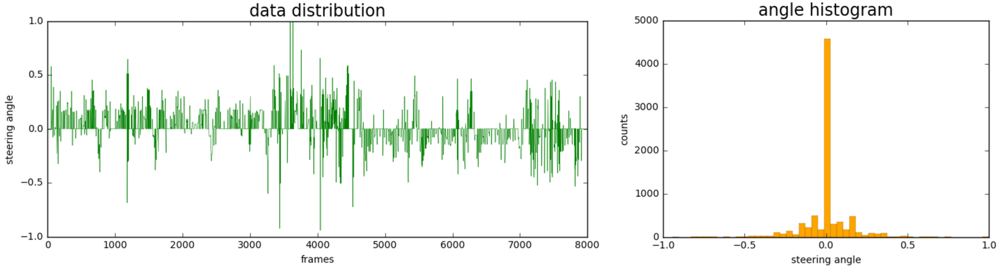  
 
This picture shows the data distribution chart of Udacity dataset.
If you finished track1 in training mode, maybe you might feel that there are lots of straight lines in the track. Yes, right. And it might cause bad results. In fact, track1 is also biased toward the left turn but not in udacity dataset. So, I needed to balance the data by reducing straight line angles.
 
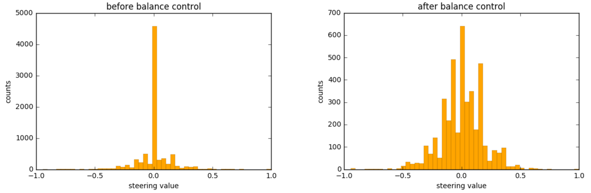
 
I adjusted zero angle data just by randomly choosing only about 10% of them. This `data balancing` was the great key to improve performance.
  
 
## Data Preprocessing  
 
 
### Generators  
  
Our dataset has limited steering angles. So we need to increase more data for the powerful network model. We could imagine many methods to augment image data such as flipping, shifting, etc. But how we load all the dataset into memory? It might impossible to store all data on the memory.  
 
I used `generator` to solve the problem. In [Keras](https://keras.io/), they provide [`fit_generator()`](https://keras.io/models/model/) function and they allow we to do **`real-time data augmentation`** on images in parallel to training our model.  
 
### Data Augmentation  
  
For the data augmentation, I added `Left, Right images` and used `flipping`, `shifting`, `changing brightness`, `generating shadow` methods.  
  
  
> **Including Left, Right images**
 
<p align="center">
    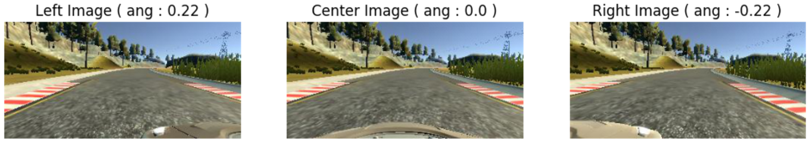
</p>
 
As mentioned earlier, we could collect many soft or hard steering angle images by including left, right camera images. It would be easy to understand after reading [NVIDIA paper](http://images.nvidia.com/content/tegra/automotive/images/2016/solutions/pdf/end-to-end-dl-using-px.pdf) because they also used 3 cameras. The most important thing when we add Left,Right images is a `offset angle`. We should reward proper angle of the offset. In fact, to calculate the exact offset, we need some information.(e.g. camera height, distance between cameras, etc.) But we didn't have any information about setting environment.(I had tried to get proper offset value with geometric methods based on some assumption but it didn't mean much.)  
 
After more than 100 tests,(seriously..) I decided to take the `offset value = 0.22`.  
 
***
> **Flipping, Shifting, Changing brightness, generating shadow**
 
<p align="center">
    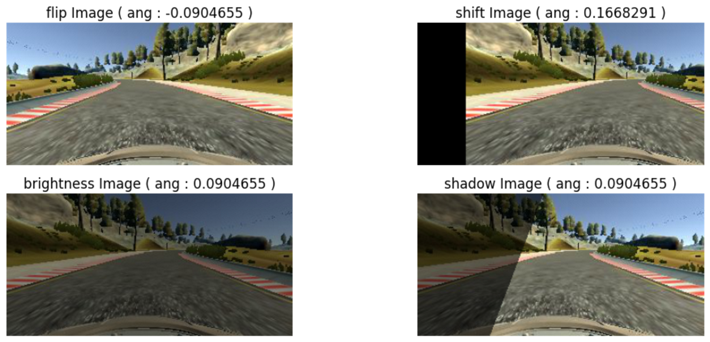
</p>
 
* __flipping image__
  - Just by flipping, we could augment data and balance left, right angles.
  - We should reverse a +,- sign of steering angle when flip the image.  
  
  
* __shifting image__
  - Move image in the x-axis direction and get various data.
  - In this case, we should reward some offsets again like Left, Right image. In the NVIDIA paper, they said `The steering label for transformed images is adjusted to one that would steer the vehicle back to the desired location and orientation in two seconds.`. So, after a lot of test, I decided to take the `angle per pixel = 0.0025`  
  
  
* __changing brightness__
  - To be a brightness-invariant, we need artificial brightness change. In fact,  Track 1 has a slightly brighter track, while track 2 is dark.
  - I converted color format RGB to HSV and changed V channel value.  
  
 
* __generating shadow__
  - This method is used for fantastic graphic mode. Udacity data is collected in fastest graphic mode. In fantastic graphic mode, there are many shadows. So I generated artificial shadow.  
  
  
  
### Crop Image   
  
  
<p align="center">
    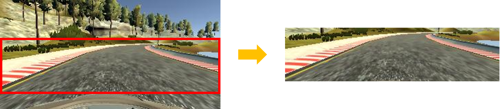
</p>
  
  
In image, a bonnet and background are not necessary to decide a exact steering angle. Therefore, I cropped the inconsequential parts.
 
### Resizing  
  
  
<p align="center">
    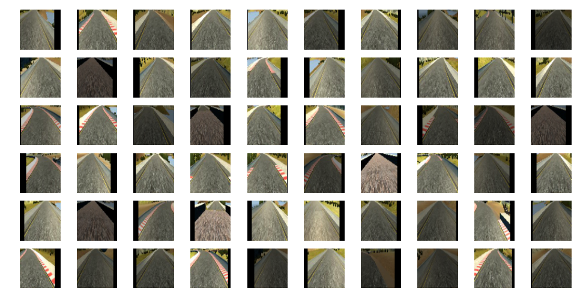
</p>
  
After data augmentation & crop, I resized image to 64x64. I tried 200x66 and 64x32 size but 64x64 size was best in my model and parameter setting. I also tested 128x128 size for better layer feature map resolution, the result was similar with 64x64.  
In NVIDIA paper, they converted RGB to YUV color space but I used a RGB image.  
  
  
## Network Architecture  
  
In this network model, the biggest difference with prior [traffic-sign project](https://github.com/windowsub0406/SelfDrivingCarND/blob/master/SDC_project_2/Traffic_Sign_Classifier.ipynb) is output. We had traffic sign labels and had classified images. But now we should estimate the continuous value(steering angle) based on dataset. It's **`regression`**. not classification.  
 
I tested NVIDIA and Comma.ai network architecture but I decided to design my model by modifying them.  
 
Layer (type)                     |Output Shape          |Param #     |Connected to                     
--- | --- | --- | ---
lambda_1 (Lambda)                |(None, 64, 64, 3)     |0           |lambda_input_1[0][0]             
Conv1 (Convolution2D)            |(None, 32, 32, 32)    |896         |lambda_1[0][0]                   
maxpooling2d_1 (MaxPooling2D)    |(None, 16, 16, 32)    |0           |Conv1[0][0]                      
Conv2 (Convolution2D)            |(None, 8, 8, 64)      |18496       |maxpooling2d_1[0][0]             
maxpooling2d_2 (MaxPooling2D)    |(None, 4, 4, 64)      |0           |Conv2[0][0]                      
Conv3 (Convolution2D)            |(None, 4, 4, 128)     |73856       |maxpooling2d_2[0][0]             
maxpooling2d_3 (MaxPooling2D)    |(None, 2, 2, 128)     |0           |Conv3[0][0]                      
Conv4 (Convolution2D)            |(None, 2, 2, 128)     |65664       |maxpooling2d_3[0][0]             
flatten_1 (Flatten)              |(None, 512)           |0           |Conv4[0][0]                      
dropout_1 (Dropout)              |(None, 512)           |0           |flatten_1[0][0]                  
FC1 (Dense)                      |(None, 128)           |65664       |dropout_1[0][0]                  
dropout_2 (Dropout)              |(None, 128)           |0           |FC1[0][0]                        
FC2 (Dense)                      |(None, 128)           |16512       |dropout_2[0][0]                  
dropout_3 (Dropout)              |(None, 128)           |0           |FC2[0][0]                        
FC3 (Dense)                      |(None, 64)            |8256        |dropout_3[0][0]                  
dense_1 (Dense)                  |(None, 1)             |65          |FC3[0][0]                        
Total params : 249,409|||
 
First, I added labda layer to normalize images [0:255] to [-1:1]. This method is used in Comma.ai model.
And added 4 Convolutional layers. The filter size is almost 3x3 and 1 2x2. I guess that the larger filter size will damage the important information of the image. There is 5x5 filter in NVIDIA model but their image size is 200x66 not 64x64. I used `relu` as a activation function, glorot_uniform for weight initialization and used maxpooling and 3 fully connected layers. It wasn't deep neural network but enough to train powerfully.
As I designed the model in prior [traffic-sign project](https://github.com/windowsub0406/SelfDrivingCarND/blob/master/SDC_project_2/Traffic_Sign_Classifier.ipynb), I had tried he's initialization and batch_normalization for preventing the overfitting and 'vanishing gradient'. I couldn't find the correct reason but it turned out to be rather unsatisfactory. So I added a droupout and it worked well.
 
I used an `Adam optimizer` for training and `learning rate = 0.0001`, `batch size : 256`, `10 epoch`.  
I also separated 10% of validation dataset after shuffling data. In fact, the validation accuracy didn't mean much in this model. Because This model prints out the continuous value. not discrete value.  
 
 
## Visualization  
  
Actually before starting this project, I really wanted to check `layer feature maps`. Luckily, I could easily check it through Keras.   
 
```python
layer1 = Model(input=model.input, output=model.get_layer('Conv1').output)
layer2 = Model(input=model.input, output=model.get_layer('Conv2').output)
 
img = cv2.imread(img_path)
img = np.expand_dims(img, axis=0)
visual_layer1, visual_layer2 = layer1.predict(img), layer2.predict(img)
```
 
<p align="center">
    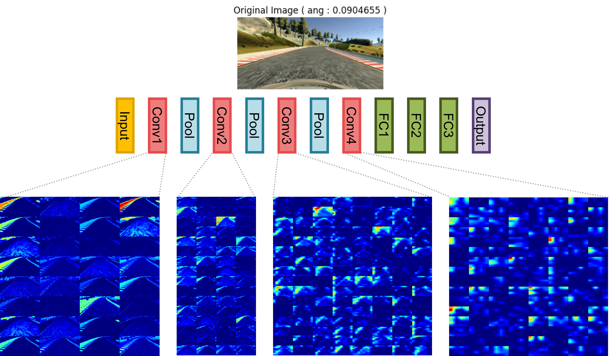
</p>
 
I visualized convolutional layer 1 and layer 2. I expected that 'the first and second layer have just simple features(e.g. line, edge, curve) and the rear layer has more complex features like texture or entire object.' [This paper](http://www.matthewzeiler.com/pubs/arxive2013/eccv2014.pdf)(Visualizing and Understanding
Convolutional Networks) shows that. But in my model it doesn't look like that. NVIDIA paper also shows slmilar result with me.  

After checking from layer 1 to layer 4, I found out that __any layer does not extract more complex features.__  
~~That's because our model is a simple regression model having 1 output.~~  
I found out the reason. :) really simple.  
The expected feature map represents visualization of trained **filter** and my feature map represents visualization of trained **layer**.  
I was confused between 'feature activation'(expected) and 'activation of the feature map'(my result).

This test brought me great information.  
  
  
## Driving  
  
```python
boost = 1 - speed / max_speed +0.3
throttle = boost if (boost < 1) else 1
 
if abs(steering_angle) > 0.3:
    throttle *=0.2
```
 
I changed a throttle value based on speed and angle. If current speed is low, I raised the throttle value. __So, I could drive fast at the starting point and uphill road.__  Also, I decreased the throttle when I'm on the sharp curve road. It was a bit of a help with soft curve driving.
 
 
## Result
  
  
>Track1 (Click for full HD video)
  
[](https://youtu.be/kad2xhUBbec)  
  
  
  
>Track2 (Click for full HD video)
  
[](https://youtu.be/Eatyx87W5V4)

  
This is my result of Track1 and Track2. You can see the whole video by clicking the gif image.  
**`My trained car moves smoothly in most cases.`** You can also check the layer1, layer2's feature map.  
  
  
<p align="center">
    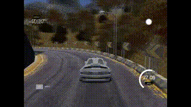 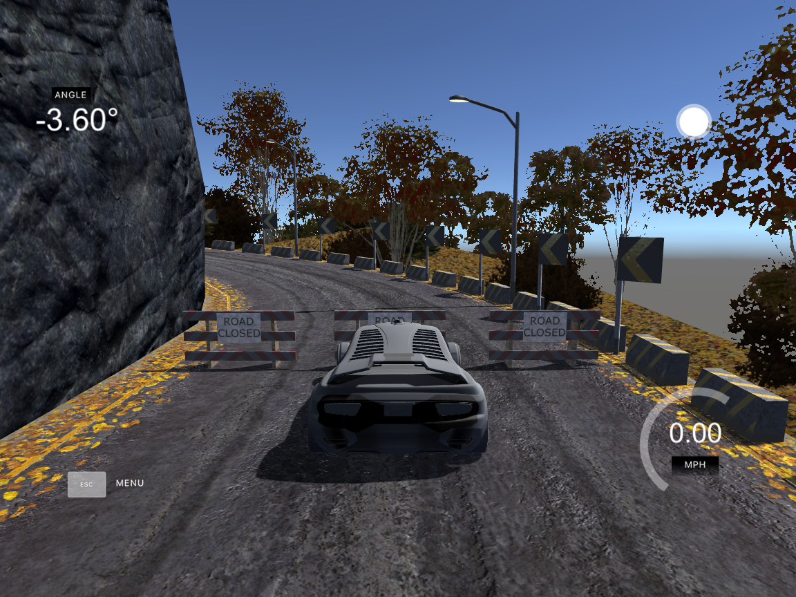<br>
    fantastic mode success with udacity dataset<br>
</p>
  
  
I also succeeded in `fantastic graphic mode` with Udacity  dataset. There are many shadows in Track2 fantastic mode. So when I augment images, I randomly added artificial shadow. If I had fantastic graphic mode dataset, the performance would be better.


I recorded the video separately and combined because of my laptop's computing power.  
 
 
 
 
## Reflection
 
Really impressive project. I have looked forward to start this project since I check the curriculum of Udacity's SDC ND. I'm particularly grateful to Udacity for giving me the great opportunity with amazing students.
From collecting data to design a network architecture, every parts were important. During completing this project, I could got used to Keras and python generator. I tried many data augmentation methods and visualized each layer's feature map. I could improve my Deep Learning knowledge. Above all, I extremely realized the importance of data quality. If I have a chance, I want to test it with real vehicle.